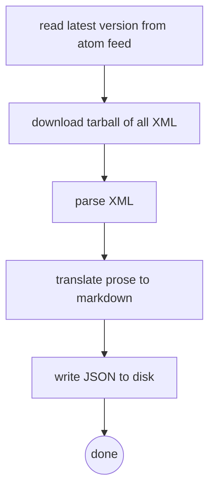
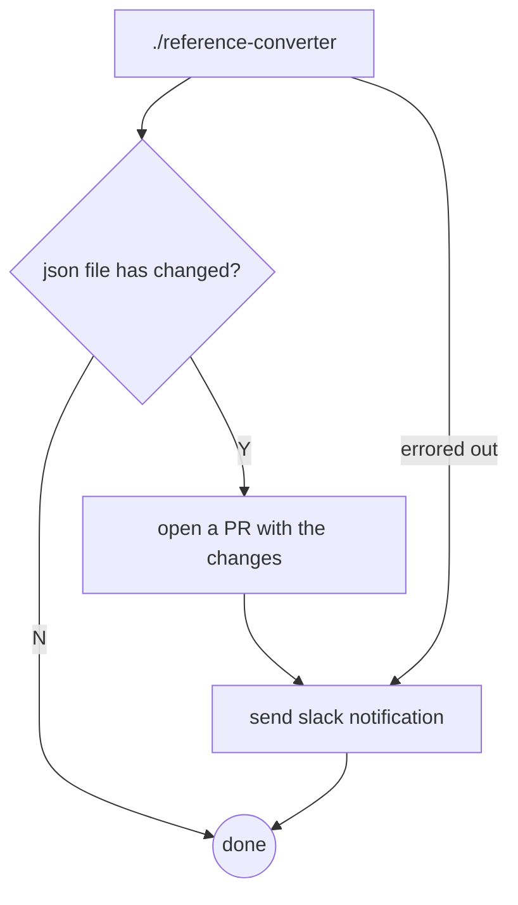

# Reference Converter

This program converts the NGINX reference documentation from it's XML schema to JSON. The generated JSON is available as an npm package in the reference-lib folder and can be used for static content generation, markdoc tags, monaco plugins, etc.

## Design



The NGINX docs are publicly available at <http://hg.nginx.org/nginx.org>, in XML that's a mix of data and prose (`<para>` tags contain markup). The `<para>` contents will be translated in-order to generate equivalent markdown.

The atom feed at <http://hg.nginx.org/nginx.org/atom-log> will tell us if there is updated content.

A scheduled github pipeline ensures that we have up-to-date reference information.



## Usage

```bash
make devtools-image
make build
./dist/reference-converter --dst <output-path>
```
